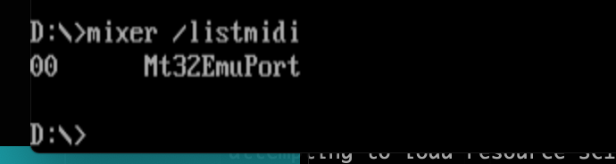

# Maddog Williams in the Patches for MT-32 Support

## The Setup
A few weeks ago Mike tried to play Maddog in Dosbox with real MT32. Unfortunately the sound wouldn't quite stop when going between rooms.

He later tried on an Atari ST with the same MT-32 hardware without that issue.

I've been reversing maddog and I had marked out the functions for Roland support but hadn't explored them yet.

Then I got a msg yesterday about possibly patching it..  So while mike was streaming I thought I'd have a look at it.

## Replicate Behaviour

First I had to get DOSbox working with MUNT. ( https://sourceforge.net/projects/munt/ )

I setup MUNT and tested with some midi files here http://www.midimusicadventures.com/queststudios/midi-soundtracks/ .. which sounded like what I thought roland sounded like.

Munt also had an issue where the "new" macos build didn't work on my macbook, had to use the "old" os build

then setup dosbox.. I have the SVN version so I could run `mixer /listmidi` to get a list of midi devices.
I had to configure Dosbox to use coreMIDI before it could pick it up.

My dosbox config for midi:

    [midi]
    mpu401     = intelligent
    mididevice = coremidi
    midiconfig = Mt32EmuPort 

I was able to confirm that dosbox was communicating with munt, I could play mt32 in dosbox and yes I could replicate the sound issue.

I added a breakpoint and could see what I thought was "stop" was being called in between rooms. It was definitely being called.

## Looking at the code

Looking at the functions I had marked out in IDA Pro:

The assembly for the STOP audio was fairly simple but I didn't quite know what it did:

    segcode:2CB6 ; ¦¦¦¦¦¦¦¦¦¦¦¦¦¦¦ S U B R O U T I N E ¦¦¦¦¦¦¦¦¦¦¦¦¦¦¦¦¦¦¦¦¦¦¦¦¦¦¦¦¦¦¦¦¦¦¦¦¦¦¦
    segcode:2CB6
    segcode:2CB6
    segcode:2CB6 s_roland_port_2CB6 proc near            ; CODE XREF: s_roland_2C64:loc_2CACp
    segcode:2CB6                                         ; s_roland_stop_audio_2CE3+Ep
    segcode:2CB6                                         ; s_roland_stop_audio_2CE3+13p
    segcode:2CB6                 push    ax
    segcode:2CB6
    segcode:2CB7
    segcode:2CB7 loc_2CB7:                               ; CODE XREF: s_roland_port_2CB6+7j
    segcode:2CB7                 mov     dx, 331h
    segcode:2CBA                 in      al, dx
    segcode:2CBB                 and     al, 40h
    segcode:2CBD                 jnz     short loc_2CB7
    segcode:2CBD
    segcode:2CBF                 mov     dx, 330h
    segcode:2CC2                 pop     ax
    segcode:2CC3                 out     dx, al
    segcode:2CC4                 retn
    segcode:2CC4
    segcode:2CC4 s_roland_port_2CB6 endp
    segcode:2CC4
    segcode:2CC5
    segcode:2CC5 ; ¦¦¦¦¦¦¦¦¦¦¦¦¦¦¦ S U B R O U T I N E ¦¦¦¦¦¦¦¦¦¦¦¦¦¦¦¦¦¦¦¦¦¦¦¦¦¦¦¦¦¦¦¦¦¦¦¦¦¦¦
    segcode:2CC5
    segcode:2CC5
    segcode:2CC5 s_roland_2CC5   proc near               ; CODE XREF: s_roland_2C64+2p
    segcode:2CC5                                         ; s_roland_stop_audio_2CE3+Ap
    segcode:2CC5                 mov     dx, 331h
    segcode:2CC5
    segcode:2CC8
    segcode:2CC8 loc_2CC8:                               ; CODE XREF: s_roland_2CC5+6j
    segcode:2CC8                 in      al, dx
    segcode:2CC9                 and     al, 40h
    segcode:2CCB                 jnz     short loc_2CC8
    segcode:2CCB
    segcode:2CCD                 mov     al, 0D7h ; '+'
    segcode:2CCF                 out     dx, al
    segcode:2CCF
    segcode:2CD0
    segcode:2CD0 loc_2CD0:                               ; CODE XREF: s_roland_2CC5+Ej
    segcode:2CD0                                         ; s_roland_2CC5+1Bj
    segcode:2CD0                 in      al, dx
    segcode:2CD1                 and     al, 80h
    segcode:2CD3                 jnz     short loc_2CD0
    segcode:2CD3
    segcode:2CD5                 mov     dx, 330h
    segcode:2CD8                 in      al, dx
    segcode:2CD9                 cmp     al, 0FEh ; '¦'
    segcode:2CDB                 jz      short locret_2CE2
    segcode:2CDB
    segcode:2CDD                 mov     dx, 331h
    segcode:2CE0                 jmp     short loc_2CD0
    segcode:2CE0
    segcode:2CE2 ; ---------------------------------------------------------------------------
    segcode:2CE2
    segcode:2CE2 locret_2CE2:                            ; CODE XREF: s_roland_2CC5+16j
    segcode:2CE2                 retn
    segcode:2CE2
    segcode:2CE2 s_roland_2CC5   endp
    segcode:2CE2
    segcode:2CE3
    segcode:2CE3 ; ¦¦¦¦¦¦¦¦¦¦¦¦¦¦¦ S U B R O U T I N E ¦¦¦¦¦¦¦¦¦¦¦¦¦¦¦¦¦¦¦¦¦¦¦¦¦¦¦¦¦¦¦¦¦¦¦¦¦¦¦
    segcode:2CE3
    segcode:2CE3
    segcode:2CE3 s_roland_stop_audio_2CE3 proc near      ; CODE XREF: s_disable_audio_70C6:loc_70F2p
    segcode:2CE3                                         ; s_timer_interrupt_70FF+25Cp
    segcode:2CE3                 push    ax
    segcode:2CE4                 push    cx
    segcode:2CE5                 push    dx
    segcode:2CE6                 mov     cx, 8
    segcode:2CE9                 mov     ax, 0B0h ; '¦'
    segcode:2CE9
    segcode:2CEC
    segcode:2CEC loc_2CEC:                               ; CODE XREF: s_roland_stop_audio_2CE3+1Aj
    segcode:2CEC                 push    ax
    segcode:2CED                 call    s_roland_2CC5
    segcode:2CED
    segcode:2CF0                 pop     ax
    segcode:2CF1                 call    s_roland_port_2CB6
    segcode:2CF1
    segcode:2CF4                 xchg    ah, al
    segcode:2CF6                 call    s_roland_port_2CB6
    segcode:2CF6
    segcode:2CF9                 xchg    ah, al
    segcode:2CFB                 inc     al
    segcode:2CFD                 loop    loc_2CEC
    segcode:2CFD
    segcode:2CFF                 pop     dx
    segcode:2D00                 pop     cx
    segcode:2D01                 pop     ax
    segcode:2D02                 retn
    segcode:2D02
    segcode:2D02 s_roland_stop_audio_2CE3 endp

Then I hand decompiled it into C to help with understanding. I have a simple script that searches and replaces asm with something vaguely C-like. Then I hand edit it to make it reasonable.

So from this:

    void s_roland_port_2CB6()
    {
        // auto tmp_ax = ax;
        push(ax);
    loc_2CB7:
        dx = 0x331;
        al = port[dx];
        al &= 0x40; // f
        // if ((result) != 0) {
        if (left != right) {
            goto loc_2CB7;
        }
        dx = 0x330;
        // ax = tmp_ax;
        ax = pop();
        port[dx] = al;
        return;
    }

    void s_roland_2CC5()
    {
        dx = 0x331;
    loc_2CC8:
        al = port[dx];
        al &= 0x40; // f
        // if ((result) != 0) {
        if (left != right) {
            goto loc_2CC8;
        }
        al = 0xd7;
        port[dx] = al;
    loc_2CD0:
        al = port[dx];
        al &= 0x80; // f
        // if ((result) != 0) {
        if (left != right) {
            goto loc_2CD0;
        }
        dx = 0x330;
        al = port[dx];
        flags = cmp(al, 0xfe); // f
        // if ((result) == 0) {
        if (left == right) {
            goto locret_2CE2;
        }
        dx = 0x331;
        goto loc_2CD0;
    locret_2CE2:
        return;
    }

    void s_roland_stop_audio_2CE3()
    {
        // auto tmp_ax = ax;
        push(ax);
        // auto tmp_cx = cx;
        push(cx);
        // auto tmp_dx = dx;
        push(dx);
        cx = 8;
        ax = 0xb0;
    loc_2CEC:
        // auto tmp_ax = ax;
        push(ax);
        s_roland_2CC5(/* ??? ax,cx,dx,bx,si,di,cf,zf */);
        // ax = tmp_ax;
        ax = pop();
        s_roland_port_2CB6(/* ??? ax,cx,dx,bx,si,di,cf,zf */);
        xchg(ah, al);
        s_roland_port_2CB6(/* ??? ax,cx,dx,bx,si,di,cf,zf */);
        xchg(ah, al);
        al += 1; // f!cf
        // END LOOP
        cx -= 1;
        // if (cx == 0) { break; }
        if (cx != 0) { goto loc_2CEC; }
        // dx = tmp_dx;
        dx = pop();
        // cx = tmp_cx;
        cx = pop();
        // ax = tmp_ax;
        ax = pop();
        return;
    }

to this:

    #include <stdint.h>

    #define DATA_PORT 0x330
    #define STAT_PORT 0x331

    // roland, send 0xd7
    void s_roland_2CC5()
    {
        uint8_t al;

        /* DATA READ READY: Check when OK to WRITE to ports. */
        for(;;) {
            al = port[STAT_PORT];
            al &= 0x40; // f
            if ((al) == 0) {
                break;
            }
        }

        port[STAT_PORT] = 0xd7;

        for(;;) {

            /* DATA READ READY: Check when OK to READ from ports. */
            al = port[STAT_PORT];
            al &= 0x80; // f

            if ((al) == 0) {
                // wait for ACK
                al = port[DATA_PORT];
                if (al == 0xfe) {
                    break;
                }
            }
        }

        return;
    }

    // roland send val_al
    void s_roland_port_2CB6(uint8_t val_al)
    {
        /* DATA READ READY: Check when OK to WRITE to ports. */
        for(;;) {
            al = port[STAT_PORT];
            al &= 0x40; // f
            if ((al) == 0) {
                break;
            }
        }

        port[DATA_PORT] = val_al;
        return;
    }

    void s_roland_stop_audio_2CE3()
    {
        // preserve ax, cx, dx

        // b0: controller off
        uint8_t al = 0xb0;

        for (int cx = 8; cx != 0; cx --) {

            // auto tmp_ax = ax;
            s_roland_2CC5();
            // ax = tmp_ax;

            s_roland_port_2CB6(al);
            s_roland_port_2CB6(0);

            al += 1; // f!cf
        }

        // unpreserve dx, cx, ax
        return;
    }

## I'm sorry, but who... I mean, what are the MPU-401s?

Then I explored what it did, and how it matched up with the MPU-401 documentation online. 

MPU-401 is the interface used to talk to midi hardware like the MT-32

This was a very good programming reference: http://www.piclist.com/techref/io/serial/midi/mpu.html as was  [the MPU-401 technical reference](./res/MPU-401 technical reference manual.pdf) 

I figured out it had some wait code to wait for a slot to write bytes to midi

There was a section where it was looping B0 to B8 and sending a 0.. that looked like the thing.. but I wasn't sure what was wrong.

I tried replacing Bx with 8x because that was note off instead of controller but didn't seem to work.

then I googled some midi tutorials and there was one here http://www.music-software-development.com/midi-tutorial.html
that talked about multiple ways of silencing. The first option looked similar to what MDW was doing.

I also saw some examples in Roland's MPU-401 technical reference that seemed to need more bytes than we were sending.

The commands to silence looked off.  It was sending an incomplete command for the ALL NOTES OFF controller. It should have been three bytes as in Bx 7B 00 but it was only sending Bx 00

So mdw wasn't sending enough bytes.  Maybe it worked with whatever midi synth they had plugged in
but not for the mt32.

## Patching

So I copied the asm into a .asm file, downloaded NASM and attemptd to assemble it. I added a couple of extra instructions to send the extra 0x7B (ALL NOTES OFF) byte

I included the previous functions because I wasn't quite sure how to adjust the offsets for caling functions.

    org   0x2cb6

    s_roland_port_2CB6:             push    ax

                                            
                    loc_2CB7:       mov     dx, 331h
                                    in      al, dx
                                    and     al, 40h
                                    jnz     short loc_2CB7

                                    mov     dx, 330h
                                    pop     ax
                                    out     dx, al
                                    retn
    

        s_roland_2CC5:              mov     dx, 331h

                                                
                    loc_2CC8:       in      al, dx
                                    and     al, 40h
                                    jnz     short loc_2CC8

                                    mov     al, 0D7h ; '+'
                                    out     dx, al

                                            
                    loc_2CD0:       in      al, dx
                                    and     al, 80h
                                    jnz     short loc_2CD0

                                    mov     dx, 330h
                                    in      al, dx
                                    cmp     al, 0FEh ; '¦'
                                    jz      short locret_2CE2

                                    mov     dx, 331h
                                    jmp     short loc_2CD0

                    locret_2CE2:                       
                                    retn

    s_roland_stop_audio_2CE3:               push    ax
                                            push    cx
                                            push    dx
                                            mov     cx, 8
                                            mov     ax, 0B0h 

                                            
                            stop_loop:      push    ax
                                            call    s_roland_2CC5

                                            pop     ax
                                            call    s_roland_port_2CB6

                                            xchg    ah, al

                                            mov     al, 0x7b        ;; THE PATCH!
                                            call    s_roland_port_2CB6    
                                            mov     al, 0x00
                                            call    s_roland_port_2CB6    

                                            xchg    ah, al
                                            inc     al
                                            loop    stop_loop

                                            pop     dx
                                            pop     cx
                                            pop     ax
                                            retn

The assembly code for the new function is actually longer than the original, so it eats into the top of an adlib related function.

(I still have to fix that by shuffling code around.)

I then took the assembled bin, and by using the C3 retn instruction as a marker, found the last function with the changes.

Rather than open the results in IDA, I double checked with an online disassmebler to make sure it looked reasonable

I pasted into dosbox as a debugger command.. and it worked!

    sm 5fc:2ce3 50 51 52 B9 08 00 B8 B0 00 50 E8 D5 FF 58 E8 C2 FF 86 E0 B0 7B E8 BB FF B0 00 E8 B6 FF 86 E0 FE C0 E2 E6 5A 59 58 C3

## Success!

Mike was streaming Abuse at this time so I opened up a hexeditor, pasted (in overwrite mode) the same string where the original was

and replaced it with my patched version.. saved it.. and then sent the zip to mike's discord.

and he tried it on stream! and it worked! Hooray!

# References

mpu401 
http://www.piclist.com/techref/io/serial/midi/mpu.html

References for midi byte stream
ftp://ftp.oldskool.org/pub/drivers/Roland/MPU-401%20technical%20reference%20manual.pdf

MIDI
* http://www.gweep.net/~prefect/eng/reference/protocol/midispec.html#Off
* http://synthmind.com/MIDI%20Standard%20Controller%20Numbers.html
* http://midi.teragonaudio.com/tech/midispec/bank.htm
* http://midi.teragonaudio.com/tech/midispec/ntnoff.htm
* https://www.midi.org/specifications-old/item/table-1-summary-of-midi-message
* http://www.music-software-development.com/midi-tutorial.html
* https://electronic-products-design.com/geek-area/communications/midi/midi-comms

online disassembler https://onlinedisassembler.com/odaweb/

nasm: 
* https://www.nasm.us/xdoc/2.15.05/html/nasmdoc8.html#section-8.1
* https://cs.lmu.edu/~ray/notes/nasmtutorial/
